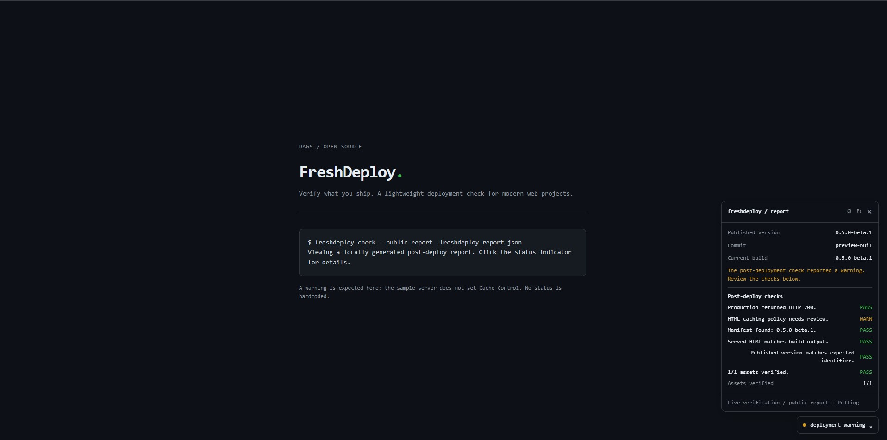
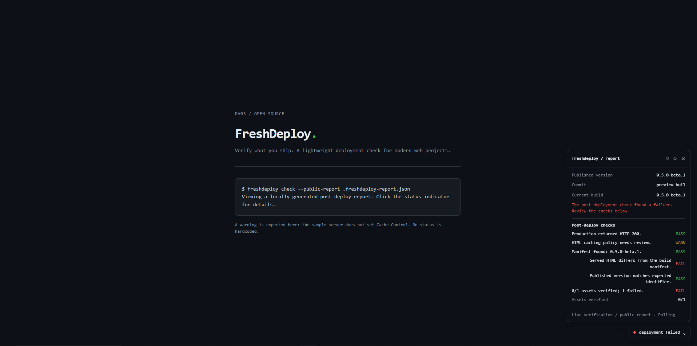
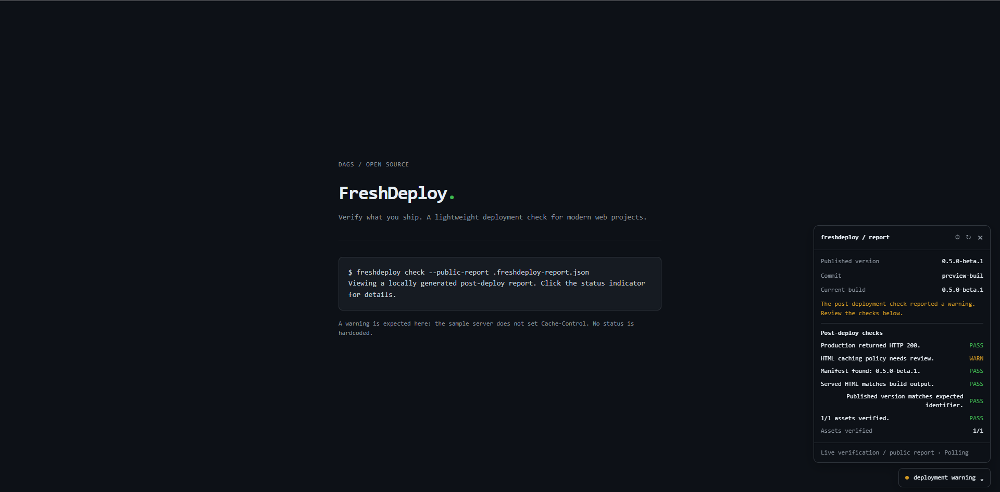
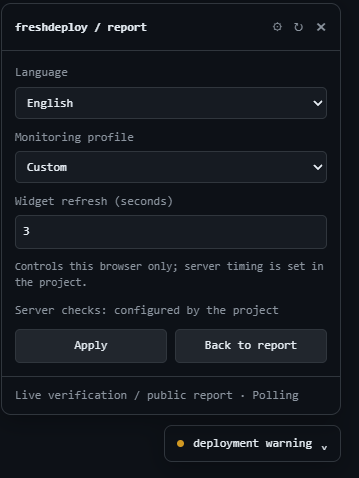
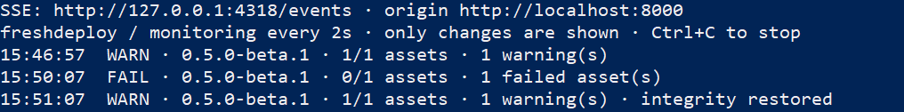

# FreshDeploy

[](https://github.com/DevDVGS/FreshDeploy/actions/workflows/ci.yml)
[](https://www.npmjs.com/package/@devdags/freshdeploy)
[](LICENSE)
[](https://nodejs.org/)

**Verify what you ship.** Minimal post-deployment verification with a compact live widget.

Node.js 20+ · MIT · English / Español

## Install

```bash
npx @devdags/freshdeploy@beta setup
```

Run once from your project root. It detects five web ecosystems; React/Vite and Vue/Vite receive automatic build hooks and an optional widget. Next.js, Angular and HTML/PHP use the generic CLI with explicit public-output configuration.

```bash
npm run build                   # automatic manifest for supported Vite apps
# deploy using your usual workflow
npx @devdags/freshdeploy@beta check     # check the deployed site afterwards
```

For live monitoring on a trusted machine, run `freshdeploy watch --live`. SSE is optional; polling is the fallback. A static site requires a post-deploy job or persistent monitor to generate updated reports.

## Screenshots

Real screenshots from the FreshDeploy local preview.

### 1. Deployment warning

The demo reports a caching warning while verifying the deployed asset.



### 2. Integrity failure detected

FreshDeploy detects a modified file: asset verification changes from 1/1 to 0/1.



### 3. Integrity restored

After restoring the original file, asset verification returns to 1/1. The demo retains its expected caching warning.



### Additional views

<details>
<summary>Widget settings and live terminal monitoring</summary>

**Widget settings**



**Live monitor — warning, failure and recovery**



</details>

## Configure

```bash
freshdeploy settings --profile local        # 2s server / 1s browser
freshdeploy settings --profile production   # 30s server / 10s browser
freshdeploy settings --language es
```

Only publish the sanitized public report, never the private diagnostic report. Version and commit may be visible to viewers of the optional widget.

[Integration](docs/integration.md) · [Monitoring](docs/automatic-monitoring.md) · [Security](docs/security.md) · [Español](docs/quick-start-es.md) · [Contributing](CONTRIBUTING.md)

> Pre-release: FreshDeploy v0.5.0-beta.1 is published on GitHub and npm. Install with npx @devdags/freshdeploy@beta setup. This is a beta release.

MIT © 2026 DAGS contributors.
